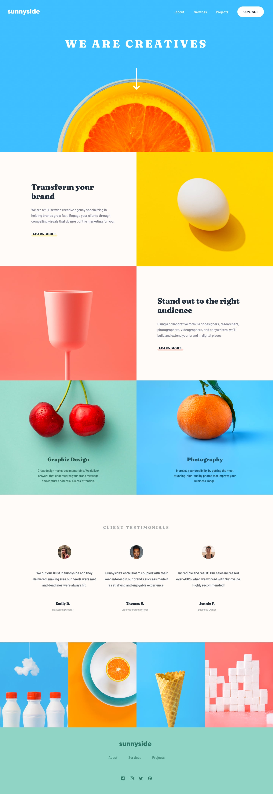

# Frontend Mentor - Sunnyside agency landing page solution

This is a solution to the [Sunnyside agency landing page challenge on Frontend Mentor](https://www.frontendmentor.io/challenges/sunnyside-agency-landing-page-7yVs3B6ef). Frontend Mentor challenges help you improve your coding skills by building realistic projects.

## Table of contents

- [Overview](#overview)
  - [The challenge](#the-challenge)
  - [Links](#links)
- [My process](#my-process)
  - [Built with](#built-with)
  - [What I learned](#what-i-learned)
- [Author](#author)
- [Acknowledgments](#acknowledgments)

## Overview

### The challenge

Users should be able to:

- View the optimal layout for the site depending on their device's screen size
- See hover states for all interactive elements on the page

### Links

- Solution URL: [Solution URL](https://github.com/FevenSeyfu/sunnyside-agency-landing-page)
- Live Site URL: [Live site URL](https://sunny-side-landing-page-feven.netlify.app/)

## My process

### Built with

- Semantic HTML5 markup
- CSS custom properties
- CSS Grid
- Mobile-first workflow

### What I learned

In this project I have used the html Picture tags to specify different image sources for different view port widths

```html
<picture>
  <source
    media="(min-width: 768px)"
    srcset="./images/desktop/image-gallery-cone.jpg"
  />
  
</picture>
```

## Author

- Website - [Feven Seyfu](https://fevenseyfu.tech/)
- Frontend Mentor - [@FevenSeyfu](https://www.frontendmentor.io/profile/FevenSeyfu)
- Linkedin - [Feven Seyfu](https://www.linkedin.com/in/fevenseyfu/)

## Acknowledgments

I would like to thank all who have reviewed my solution and given me feedback and Frontend mentors for providing the assets and design files I have used for the project.
